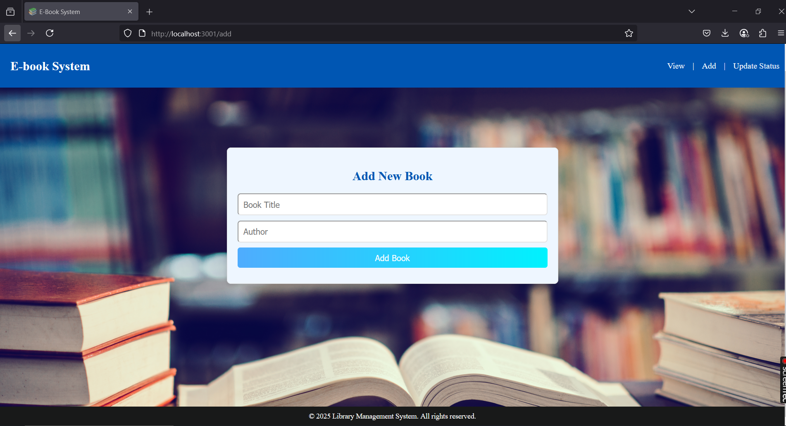
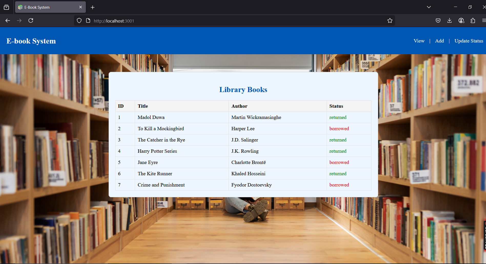
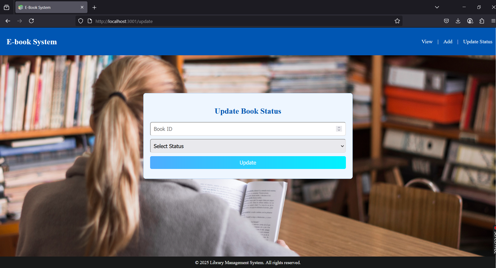

# 📚 Library Management System

A simple **Library Management System** built with **React** for the frontend and **Node.js** with **MySQL** for the backend.

---

## 🚀 Features
- Add new books to the library.
- View the list of books.
- Update the status of books (e.g., Borrowed, Returned).
- Responsive design for better user experience.

---

## 🛠️ Setup Instructions

### 1. **Backend Setup**
1. Ensure you have **Node.js** and **MySQL** installed on your system.
2. Navigate to the backend directory:
   ```bash
   cd System/backend
   ```
3. Install the required dependencies:
   ```bash
   npm install
   ```
4. Set up the MySQL database:
   - Create a database named `LibraryManagement`.
   - Use the following SQL script to create the `books` table:
     ```sql
     CREATE TABLE books (
         id INT AUTO_INCREMENT PRIMARY KEY,
         title VARCHAR(255) NOT NULL,
         author VARCHAR(255) NOT NULL,
         status ENUM('borrowed', 'returned') DEFAULT 'returned'
     );
     ```
5. Start the backend server:
   ```bash
   node server.js
   ```
6. Once the server starts, you should see:
   ```
   Connected to MySQL...
   ```

---

### 2. **Frontend Setup**
1. Navigate to the frontend directory:
   ```bash
   cd System/frontend
   ```
2. Install the required dependencies:
   ```bash
   npm install
   ```
3. Start the frontend development server:
   ```bash
   npm start
   ```
4. Open your browser and navigate to:
   ```
   http://localhost:3000
   ```

---

## 📂 Project Structure
```
Library Management System
├── backend
│   ├── server.js          # Backend server code
│   ├── package.json       # Backend dependencies
│   └── ...
├── frontend
│   ├── src
│   │   ├── components     # React components
│   │   ├── App.js         # Main React app
│   │   └── index.css      # Global styles
│   ├── public
│   │   ├── index.html     # HTML template
│   │   └── favicon.ico    # Browser tab icon
│   └── package.json       # Frontend dependencies
└── README.md              # Project documentation
```

---

## 🖼️ Screenshots
### 1. **Add Book Page**


### 2. **View Books Page**


### 3. **Update Book Status Page**


---

## 📝 Notes
- Ensure the backend server is running before starting the frontend.
- Update the database connection details in `server.js` if needed.

---

## 🧑‍💻 Author
- **Sewmini Jayawardhana**  
  [GitHub Profile](https://github.com/sewminiJayawardhana)

---

## 📜 License
This project is licensed under the MIT License.